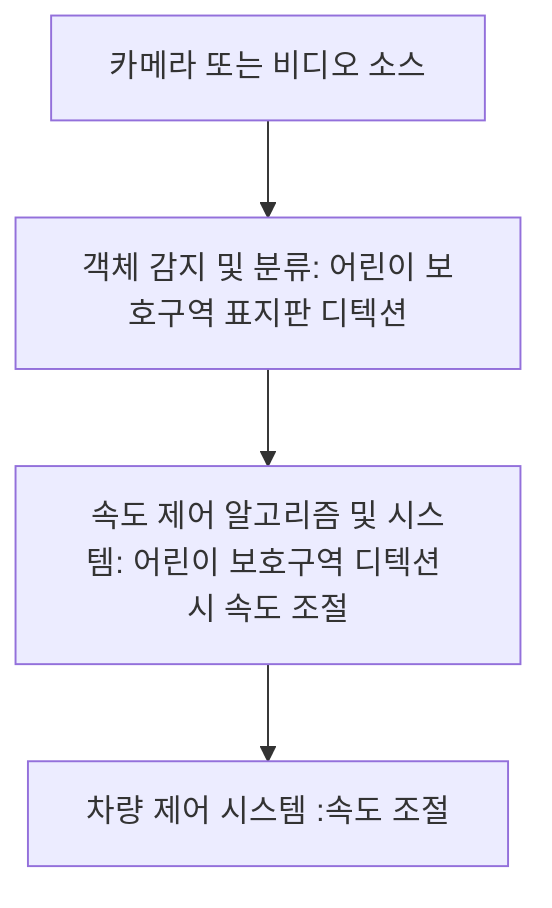

# Driver-fatigue-measurement-and-warning-notification-project-using-CNN
Driver fatigue measurement and warning notification project using CNN

수행기간 : 2024.02.13.~2024.02.22

담당역할 : - 커스텀 데이터셋 제작
          - 얼굴 인식 가이드라인 제작
          - CNN 학습 코드 서브

수행목표 : -이미지 인식을 통해 보호구역에 진입시 자동으로 속도 조절
          - 얼굴인식과 전처리 과정을 거친 이미지를 데이터로 가공하여 CNN로 특징을 추출
          - CNN 학습된 모델을 실시간 영상에 적용하여 운전자의 상태를 분석

사용기술 : Python, PyTorch, OpenCV, Dlib

환경설정 : * [Ubuntu](./doc/environment/ubuntu.md)
          * [OpenVINO](./doc/environment/openvino.md)
          * [YOLOv8](https://github.com/ultralytics/ultralytics/blob/main/README.md)

세부수행내용 : 

■ 프로젝트 개요
1) 개발 배경
 최근 몇 년 간 봄철(3~5월) 졸음운전으로 인한 교통사고가 하루 마다 평균 7건 발생했다.
이번 프로젝트를 통해 운전자의 피로도를 측정하고 경고함으로써 졸음운전 발생사고를 예방하고자 한다.


2) 개발 목표
 - 얼굴인식과 전처리 과정을 거친 이미지를 데이터로 가공하여 CNN로 특징을 추출
 - CNN 학습된 모델을 실시간 영상에 적용하여 운전자의 상태를 분석

■ flow chart


-------------------

1. 카메라 또는 비디오 소스:

 
     -차량에 장착된 카메라나 비디오 소스로부터 영상을 획득합니다.

   
2. 객체 감지 및 분류:

 
     -객체 감지 및 분류 모델(YOLO 등)을 사용하여 어린이 보호구역 표지판이나 구역 내 도로를 디텍트합니다.

   
3. 속도 제어 알고리즘 및 시스템:


     -어린이 보호구역 표지판이 감지되면, 속도를 제어하기 위한 알고리즘과 시스템이 활성화됩니다.
   
     -알고리즘은 어린이 보호구역 표지판의 감지 여부에 따라 속도를 조절하거나 유지하는 방식을 결정합니다.

  
4. 차량 제어 시스템:


     -속도를 제어하는 매커니즘은 차량 스로틀 제어 등과 연결됩니다.
   
     -어린이 보호구역 표지판이 감지되면 속도를 감소시키거나, 그외의 경우에는 정상적인 운행을 위해 속도를 조절합니다.
   
■ 시스템 구성


1. Normal 평상시 운전자 상태
2. Eye Closed상태 – 1초마다 blink count+1
3. Yawing상태 – 1회 하품시 yawn count +1

## Clone code

* repository에 대한 code clone 방법

```shell
git clone https://github.com/LIH00/protectPJ.git
```

## Prerequite

* 프로잭트를 실행하기 위해 필요한 dependencies 및 configuration 설치 및 설정 방법

```shell
python -m venv .env
source .env/bin/activate
pip install -r requirements.txt
```

## Steps to build

* 프로젝트를 실행을 위해 빌드 절차 기술

```shell
cd ~/openvino_notebooks
source .env/bin/activate

git clone https://github.com/ultralytics/ultralytics.git
pip install yolov8
yolo predict

```

## Steps to run

* 프로젝트 실행방법에 대해서 기술
* project 폴더 다운로드
* .pt 모델 경로 설정 후 실행

```shell
model1 = YOLO('/examPath/besthw2.pt')
model2 = YOLO('/examPath/updatepj.pt')
model3 = YOLO('/examPath/bestBchan2.pt')
```


## Output

* 프로젝트 실행 화면    
  


## Appendix

* 참고 자료 및 알아두어야할 사항들 기술
* 
4. ■ 기대 효과
- 운전자의 상태를 분석해 졸음운전으로 일어날 사고를 예방.
